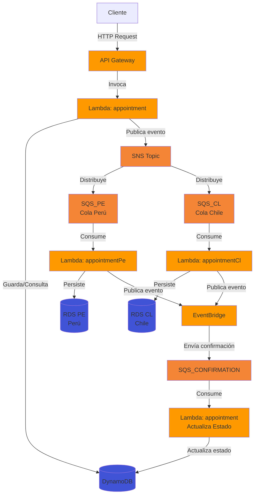

# medical-appointment-backend
Backend para un sistema de agendamiento de citas, diseñado con una arquitectura distribuida que integra API Gateway, SNS, SQS y múltiples bases de datos optimizadas para garantizar alto rendimiento, escalabilidad y resiliencia.

## Arquitectura del Sistema

### Flujo de la Arquitectura

1. **Entrada de Peticiones**: El cliente envía peticiones HTTP a través del API Gateway
2. **Procesamiento Inicial**: La Lambda `appointment` recibe la petición, guarda la información en DynamoDB y publica un evento al SNS Topic
3. **Distribución por País**: El SNS Topic distribuye el evento a las colas SQS correspondientes según el país (SQS_PE para Perú, SQS_CL para Chile)
4. **Procesamiento por País**: Las Lambdas `appointmentPe` y `appointmentCl` consumen mensajes de sus respectivas colas y persisten los datos en sus bases de datos RDS correspondientes
5. **Eventos de Confirmación**: Las Lambdas de país publican eventos a EventBridge
6. **Actualización de Estado**: EventBridge envía confirmaciones a SQS_CONFIRMATION, que es consumida por la Lambda `appointment` para actualizar el estado en DynamoDB