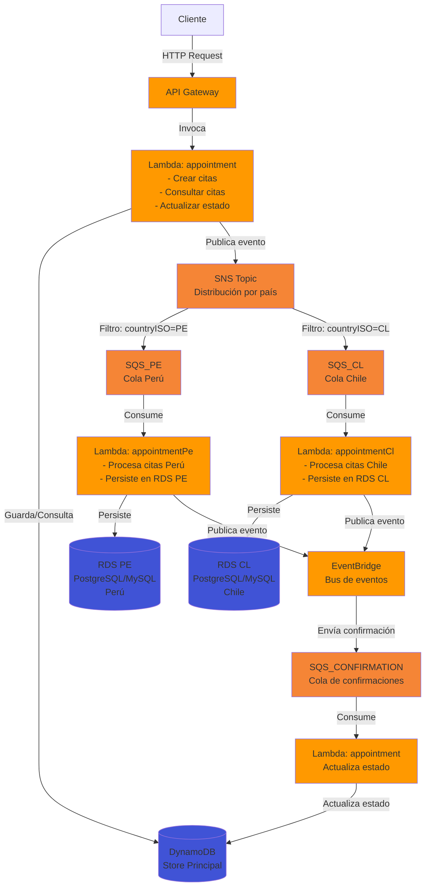

# Arquitectura del Sistema

## Descripción General

Este sistema implementa una arquitectura distribuida basada en eventos para el manejo de citas médicas, diseñada siguiendo los principios de Clean Architecture y Domain-Driven Design. La solución aprovecha servicios serverless de AWS para garantizar alta disponibilidad, escalabilidad automática y resiliencia ante fallos.

La arquitectura se estructura en capas bien definidas: dominio, aplicación, infraestructura e interfaces, permitiendo un desacoplamiento completo entre la lógica de negocio y los detalles de implementación. El sistema utiliza un patrón de publicación/suscripción mediante SNS y SQS para distribuir eventos de manera asíncrona, con procesamiento específico por país (Perú y Chile) que persiste datos en bases de datos RDS dedicadas.

## Servicios AWS Utilizados

El sistema utiliza los siguientes servicios de AWS:

- **API Gateway**: Punto de entrada HTTP para todas las peticiones del cliente, proporcionando autenticación, autorización, throttling y transformación de peticiones
- **Lambda**: Funciones serverless que ejecutan la lógica de negocio sin gestión de servidores, escalando automáticamente según la demanda
- **DynamoDB**: Base de datos NoSQL de alto rendimiento utilizada como store principal para consultas rápidas y escrituras de baja latencia
- **SNS (Simple Notification Service)**: Servicio de mensajería pub/sub que distribuye eventos de manera desacoplada a múltiples suscriptores
- **SQS (Simple Queue Service)**: Colas de mensajes que garantizan la entrega y procesamiento asíncrono de eventos, con soporte para filtrado por país
- **RDS (Relational Database Service)**: Bases de datos relacionales PostgreSQL/MySQL dedicadas por país para persistencia transaccional y reportes
- **EventBridge**: Bus de eventos que orquesta el flujo de confirmaciones y actualizaciones de estado de manera desacoplada

## Responsabilidades de las Lambdas

### Lambda: `appointment`

**Responsabilidades principales:**
- Recibe peticiones HTTP desde API Gateway para crear y consultar citas
- Valida los datos de entrada mediante validadores de dominio
- Ejecuta el caso de uso `CreateAppointmentUseCase` para crear nuevas citas con estado "pending"
- Persiste la cita inicial en DynamoDB mediante `AppointmentWriteRepository`
- Publica el evento `AppointmentRequestedEvent` al SNS Topic para distribución asíncrona
- Ejecuta el caso de uso `GetAppointmentsByInsuredUseCase` para consultar citas por asegurado
- Consume mensajes de la cola SQS_CONFIRMATION para actualizar el estado de citas a "completed"
- Ejecuta el caso de uso `CompleteAppointmentUseCase` para marcar citas como completadas en DynamoDB

**Endpoints:**
- `POST /appointments`: Crear nueva cita
- `GET /appointments?insuredId={id}`: Consultar citas por asegurado

### Lambda: `appointmentPe`

**Responsabilidades principales:**
- Consume mensajes de la cola SQS_PE (Perú) de manera asíncrona
- Procesa eventos `AppointmentRequestedEvent` específicos para el país de Perú
- Persiste la información de la cita en la base de datos RDS dedicada para Perú
- Publica el evento `AppointmentCompletedEvent` a EventBridge tras la persistencia exitosa
- Maneja errores y reintentos mediante la configuración de dead-letter queue de SQS

### Lambda: `appointmentCl`

**Responsabilidades principales:**
- Consume mensajes de la cola SQS_CL (Chile) de manera asíncrona
- Procesa eventos `AppointmentRequestedEvent` específicos para el país de Chile
- Persiste la información de la cita en la base de datos RDS dedicada para Chile
- Publica el evento `AppointmentCompletedEvent` a EventBridge tras la persistencia exitosa
- Maneja errores y reintentos mediante la configuración de dead-letter queue de SQS

## Flujo de Vida de un Appointment

### 1. Creación de la Cita (Request)

1. **Cliente envía petición HTTP**: El cliente realiza una petición `POST /appointments` a través de API Gateway con los datos: `insuredId`, `scheduleId` y `countryISO`

2. **API Gateway valida y enruta**: API Gateway valida la petición, aplica políticas de seguridad y autenticación, y enruta a la Lambda `appointment`

3. **Validación de dominio**: La Lambda `appointment` ejecuta el validador `createAppointmentValidator` para validar los datos de entrada según las reglas de negocio

4. **Creación de la entidad**: Se ejecuta `CreateAppointmentUseCase` que:
   - Genera un `appointmentId` único mediante UUID v4
   - Crea una instancia de la entidad `Appointment` con estado "pending"
   - Establece timestamps `createdAt` y `updatedAt`

5. **Persistencia inicial en DynamoDB**: Se invoca `AppointmentWriteRepository.createPending()` para guardar la cita en DynamoDB con estado "pending", permitiendo consultas inmediatas

6. **Publicación de evento**: Se publica el evento `AppointmentRequestedEvent` al SNS Topic, incluyendo: `appointmentId`, `insuredId`, `scheduleId` y `countryISO`

7. **Respuesta al cliente**: La Lambda retorna la entidad `Appointment` creada con código HTTP 201

### 2. Distribución por País (Routing)

8. **Filtrado por SNS**: El SNS Topic evalúa el atributo `countryISO` del mensaje y lo enruta a la cola SQS correspondiente:
   - Si `countryISO === "PE"` → SQS_PE
   - Si `countryISO === "CL"` → SQS_CL

### 3. Procesamiento Específico por País (Processing)

9. **Consumo de cola**: La Lambda correspondiente (`appointmentPe` o `appointmentCl`) consume el mensaje de su cola SQS respectiva

10. **Persistencia en RDS**: La Lambda persiste la información de la cita en la base de datos RDS del país correspondiente, utilizando Prisma como ORM

11. **Publicación de confirmación**: Tras la persistencia exitosa, se publica el evento `AppointmentCompletedEvent` a EventBridge

### 4. Actualización de Estado (Completion)

12. **Orquestación por EventBridge**: EventBridge recibe el evento `AppointmentCompletedEvent` y lo enruta a la cola SQS_CONFIRMATION según reglas de enrutamiento configuradas

13. **Consumo de confirmación**: La Lambda `appointment` consume el mensaje de SQS_CONFIRMATION

14. **Actualización en DynamoDB**: Se ejecuta `CompleteAppointmentUseCase` que invoca `AppointmentWriteRepository.markCompleted()` para actualizar el estado de la cita de "pending" a "completed" en DynamoDB

15. **Estado final**: La cita queda marcada como "completed" en DynamoDB, disponible para consultas y reportes

### 5. Consulta de Citas (Query)

16. **Consulta por asegurado**: El cliente realiza una petición `GET /appointments?insuredId={id}` a través de API Gateway

17. **Lectura desde DynamoDB**: La Lambda `appointment` ejecuta `GetAppointmentsByInsuredUseCase` que invoca `AppointmentReadRepository.findByInsuredId()` para consultar todas las citas del asegurado desde DynamoDB

18. **Respuesta al cliente**: Se retorna la lista de citas con código HTTP 200

## Diagrama de Arquitectura

## Por Qué Esta Arquitectura es Óptima

### 1. Separación de Responsabilidades y Clean Architecture

La arquitectura implementa una clara separación entre dominio, aplicación, infraestructura e interfaces. Esto permite:
- **Mantenibilidad**: Cambios en la infraestructura no afectan la lógica de negocio
- **Testabilidad**: Cada capa puede ser testeada de forma independiente mediante mocks
- **Escalabilidad del equipo**: Diferentes equipos pueden trabajar en diferentes capas sin conflictos

### 2. Escalabilidad Automática y Serverless

El uso de servicios serverless (Lambda, API Gateway, SQS) proporciona:
- **Escalado automático**: El sistema escala de 0 a miles de peticiones sin configuración manual
- **Optimización de costos**: Solo se paga por el tiempo de ejecución real, sin costos de infraestructura ociosa
- **Alta disponibilidad**: AWS gestiona la redundancia y disponibilidad de los servicios

### 3. Desacoplamiento mediante Event-Driven Architecture

El patrón de eventos asíncronos mediante SNS y SQS ofrece:
- **Resiliencia**: Si un componente falla, los mensajes permanecen en la cola para procesamiento posterior
- **Desacoplamiento temporal**: Los productores y consumidores no necesitan estar activos simultáneamente
- **Extensibilidad**: Nuevos consumidores pueden suscribirse a eventos sin modificar el código existente

### 4. Separación de Datos por País

La arquitectura utiliza bases de datos RDS dedicadas por país, lo que proporciona:
- **Cumplimiento regulatorio**: Datos de cada país pueden residir en regiones específicas según requerimientos legales
- **Aislamiento de fallos**: Un problema en la base de datos de un país no afecta a otros
- **Optimización de rendimiento**: Consultas y reportes por país no compiten por recursos con otros países
- **Escalabilidad independiente**: Cada base de datos puede escalarse según la demanda específica del país

### 5. Patrón CQRS Simplificado

La separación entre DynamoDB (lecturas rápidas) y RDS (escrituras transaccionales) implementa un patrón CQRS que:
- **Optimiza lecturas**: DynamoDB proporciona latencias sub-milisegundo para consultas frecuentes
- **Garantiza consistencia**: RDS proporciona transacciones ACID para operaciones críticas
- **Mejora el rendimiento**: Las escrituras asíncronas no bloquean las lecturas

### 6. Garantía de Entrega y Procesamiento

El uso de SQS con dead-letter queues asegura:
- **Durabilidad**: Los mensajes se almacenan de forma persistente hasta ser procesados
- **Reintentos automáticos**: Los mensajes fallidos se reintentan según políticas configuradas
- **Manejo de errores**: Los mensajes que fallan repetidamente se envían a DLQ para análisis

### 7. Observabilidad y Trazabilidad

La arquitectura distribuida permite:
- **Trazabilidad completa**: Cada evento puede ser rastreado desde su origen hasta su procesamiento
- **Monitoreo granular**: CloudWatch proporciona métricas y logs para cada componente
- **Debugging facilitado**: Los identificadores únicos (appointmentId) permiten rastrear una cita a través de todo el sistema

### 8. Flexibilidad y Evolución

La arquitectura modular permite:
- **Agregar nuevos países**: Basta con crear una nueva cola SQS, Lambda y RDS, y configurar el filtro en SNS
- **Modificar lógica de negocio**: Los casos de uso encapsulan la lógica, facilitando cambios sin afectar interfaces
- **Integrar nuevos sistemas**: EventBridge puede enrutar eventos a sistemas externos sin modificar el código core

### 9. Optimización de Costos

La arquitectura serverless optimiza costos mediante:
- **Pago por uso**: Solo se factura por invocaciones y tiempo de ejecución real
- **Sin infraestructura ociosa**: No hay servidores corriendo 24/7 esperando peticiones
- **Escalado a cero**: En períodos de baja demanda, los costos se reducen a cero

### 10. Seguridad y Compliance

La arquitectura implementa seguridad en múltiples capas:
- **API Gateway**: Proporciona autenticación, autorización y protección DDoS
- **IAM Roles**: Cada Lambda tiene permisos mínimos necesarios (principio de menor privilegio)
- **Encriptación**: Datos en tránsito (TLS) y en reposo (encriptación de bases de datos)
- **Aislamiento de red**: VPC para bases de datos RDS con acceso controlado

Esta arquitectura representa un equilibrio óptimo entre rendimiento, escalabilidad, mantenibilidad y costo, siguiendo las mejores prácticas de la industria para sistemas distribuidos en la nube.

